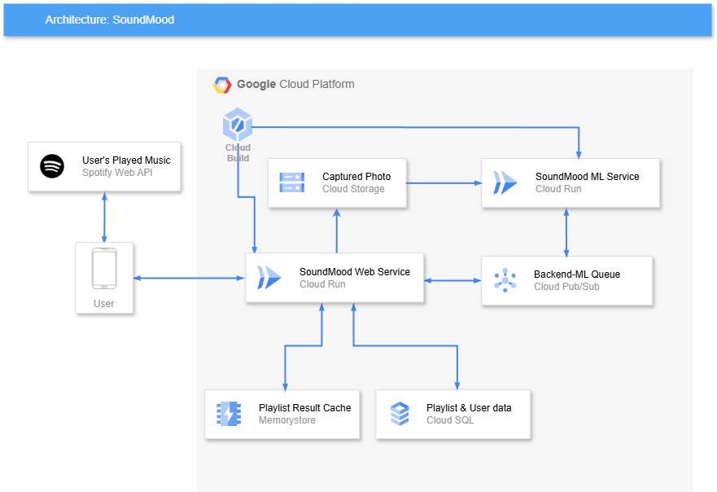

# cloud-computing
<p align="center">
  
</p>

<h1 align="center">SoundMood</h1>

<div align="center">

</div>

> Base url of this service is: http://localhost:8081/

The service available:

- Authorization
  <pre>POST /auth/token</pre>

- Predictions
  <pre>POST /me/predict</pre>

- Playlist
  <pre>GET /me/playlist</pre>
  <pre>GET /me/playlist/{playlist_id}</pre>
  <pre>PUT /me/playlist/{playlist_id}</pre>

- User
  <pre>GET /me</pre>

# Quick Look

## Architecture

<p align="center">
  
</p>

# Authentications


# Environment

In order to run this project, you need to configure the following environment variables:

```bash
  DATABASE_URL: {database_url}
  JWT_SECRET: {your jwt secret}
  SHA_SECRET: {your sha key}
  REDIS_HOST: {your redis ip}
  REDIS_PORT: {your redis port}
  BUCKET_NAME: {your gcp bucket}
  PROJECT_ID: {your gcp projec id}
  TOPIC_NAME: {your pub/sub topic name}
  ALGORITHM: HS256
  HOST: 0.0.0.0
```

Then you can use the following image to create your own database:


### Dependency


# Testing

This Web service uses Postman to test.

- You can download the Postman documentation [here]().

If you want to contribute to this project, please contact me.

# Pull Requests


## Contributors

### CC Member 
CC member is responsible for the development of the API service and deployment of the model. In sort, in this project CC is responsible for Backend, infrastructure, and DevOps.
#### Individuals


### ML Member
#### Individuals

### MD Member
#### Individuals
